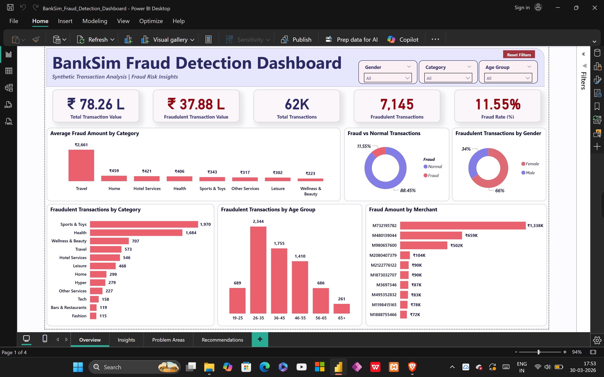
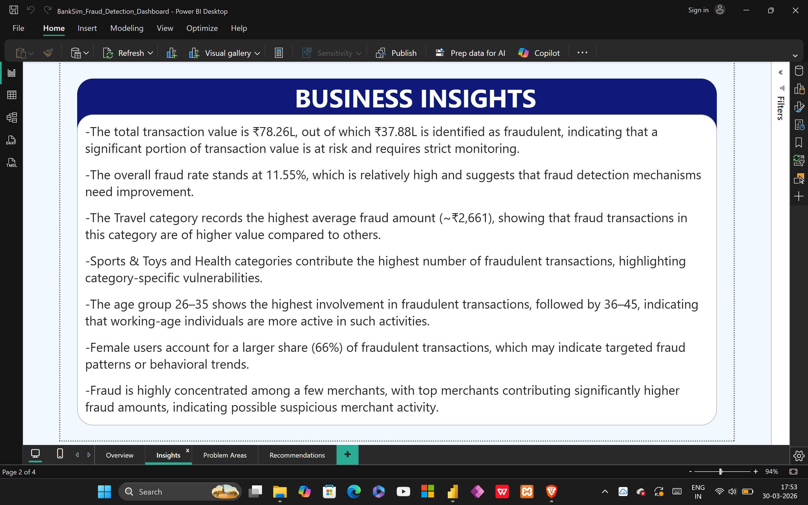
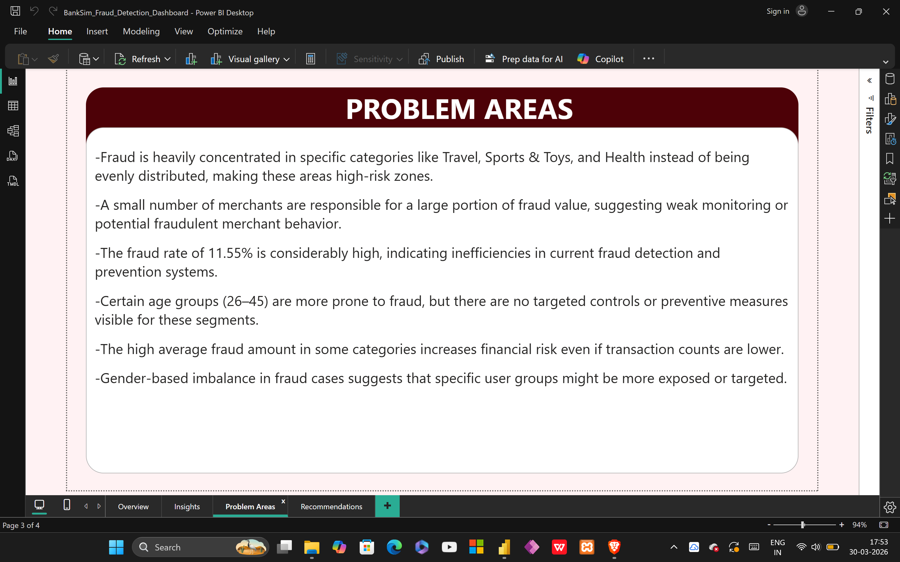
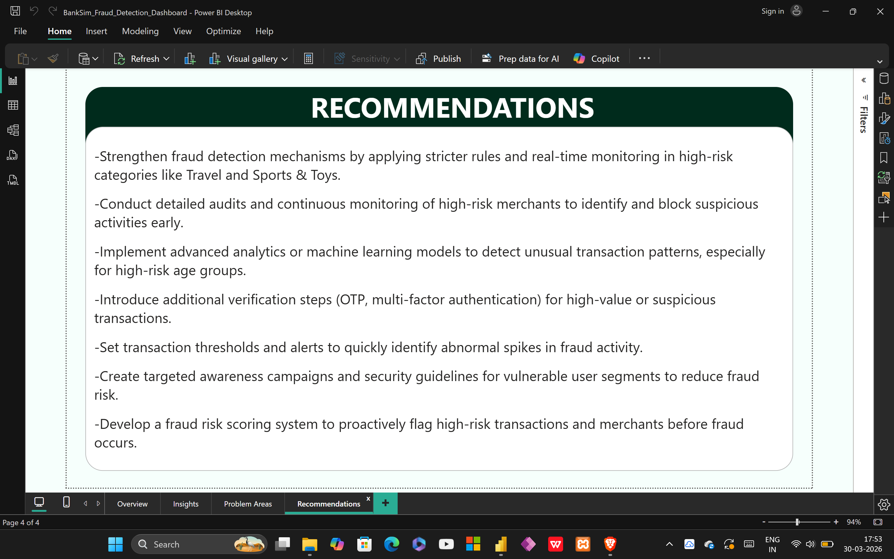

# Bank Fraud Detection Analysis Project

1. Project Overview  
This project focuses on analyzing banking transaction data to identify fraud patterns, high-risk areas, and vulnerable customer segments.  
The dashboard provides a comprehensive view of fraud distribution across categories, age groups, merchants, and transaction values to support better decision-making.

2. Objectives  
- Identify high-risk transaction categories  
- Detect fraud concentration across customer segments  
- Analyze merchant-level fraud contribution  
- Evaluate overall fraud rate and financial risk  
- Provide actionable insights for fraud prevention  

3. Dashboard Features  
- KPI Cards showing total transactions, fraud value, and fraud rate  
- Category-wise fraud analysis  
- Age group and gender-based fraud distribution  
- Fraud vs Normal transaction comparison  
- Merchant-level fraud contribution analysis  
- Interactive filters (Gender, Category, Age Group)  

4. Key Insights  
- Fraud rate is 11.55%, indicating high financial risk  
- Travel category shows highest average fraud amount  
- Sports & Toys and Health categories have highest fraud volume  
- Age group 26–35 is most involved in fraud activities  
- Female users account for majority of fraudulent transactions  
- Fraud is concentrated among a small number of merchants  

5. Problem Areas  
- Fraud is concentrated in specific categories instead of being evenly distributed  
- A small number of merchants contribute heavily to fraud  
- High fraud rate indicates gaps in detection systems  
- Lack of targeted controls for high-risk age groups  
- High-value fraud increases financial exposure  
- Imbalance in gender-based fraud patterns  

6. Recommendations  
- Implement stricter monitoring in high-risk categories  
- Continuously audit high-risk merchants  
- Use machine learning models for anomaly detection  
- Introduce multi-factor authentication for risky transactions  
- Set transaction thresholds and real-time alerts  
- Conduct awareness programs for vulnerable users  
- Develop a fraud risk scoring system  

7. Files in Repository  
- BankSim_Fraud_Detection_Dashboard.pbix → Power BI dashboard file  
- Dataset.zip → Dataset used for analysis  
- Dashboard-Overview.png → Dashboard main view  
- Business-Insights-Page.png → Insights page  
- Problem-Areas-Page.png → Problem analysis  
- Recommendations-Page.png → Suggested actions  
- INSIGHTS.md → Detailed insights document  

8. Dashboard Preview  

Overview Page  

Business Insights Page  

Problem Areas Page  

Recommendations Page  

9. Tools and Technologies  
- Power BI  
- DAX  
- Data Modeling  
- Data Visualization  

10. Conclusion  
This project highlights how data analytics can be used to identify fraud patterns and improve financial security.  
The insights derived can help organizations take proactive measures to reduce fraud risk and enhance monitoring systems.
