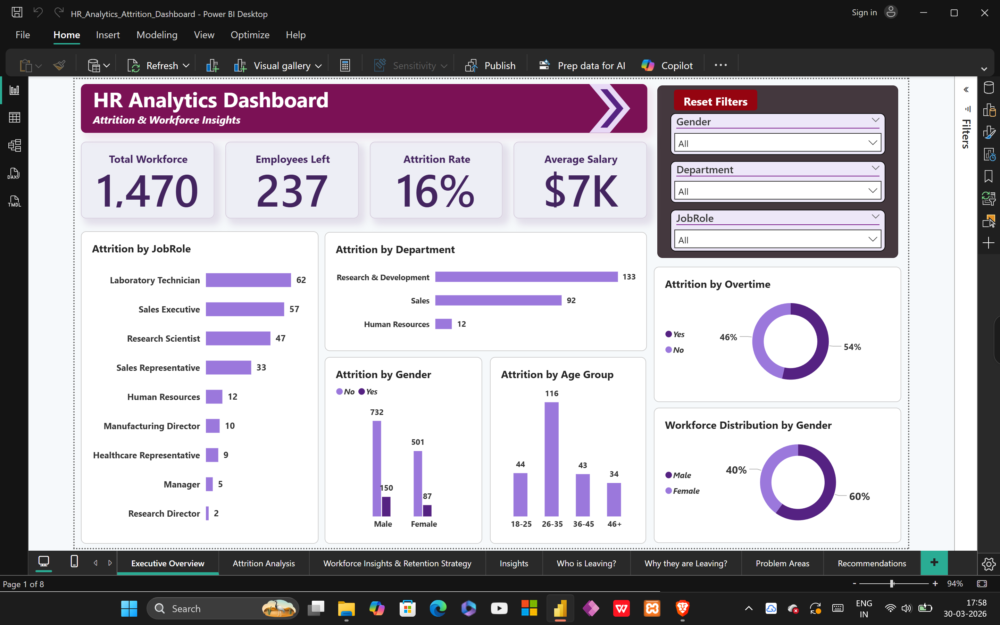
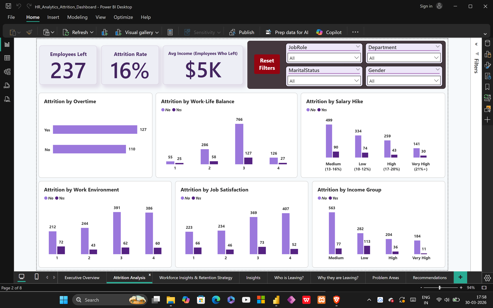
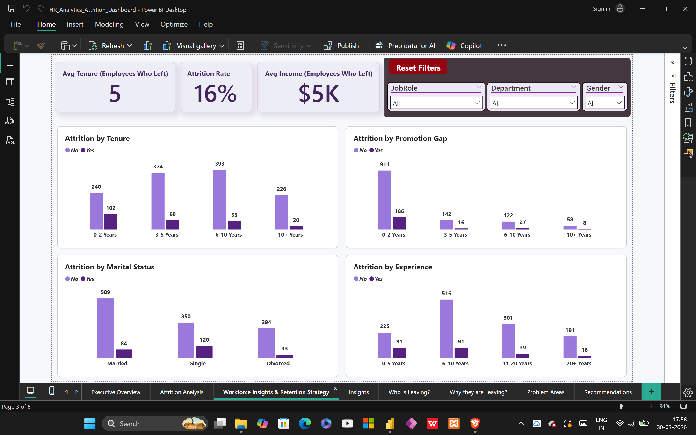
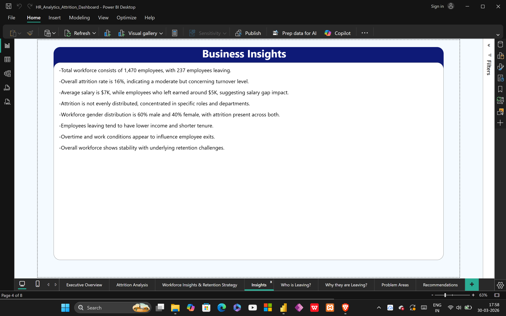
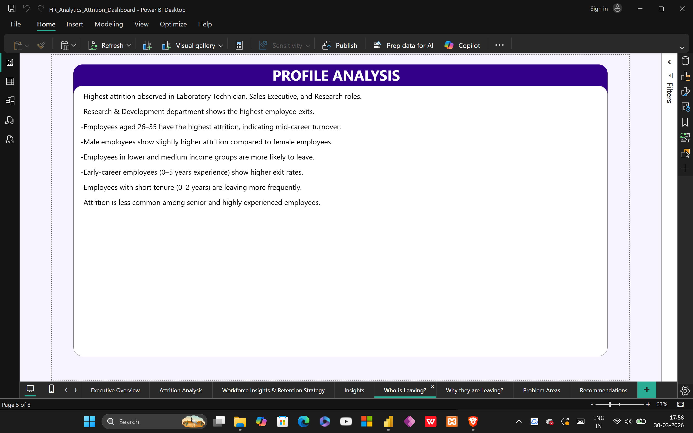
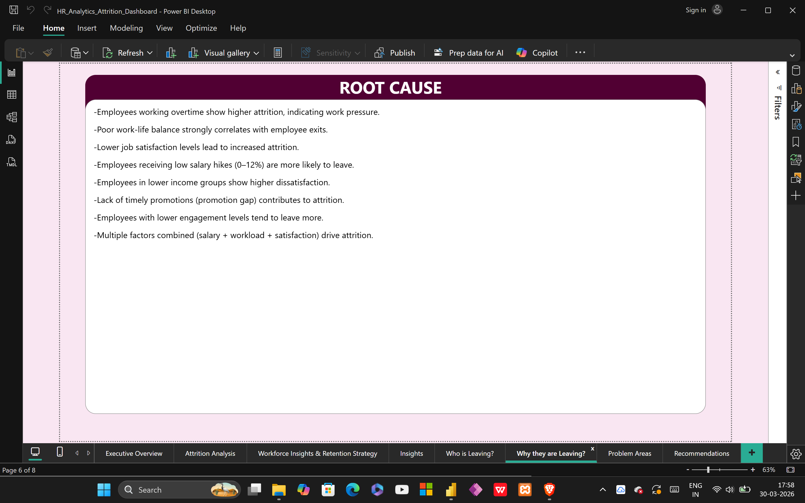
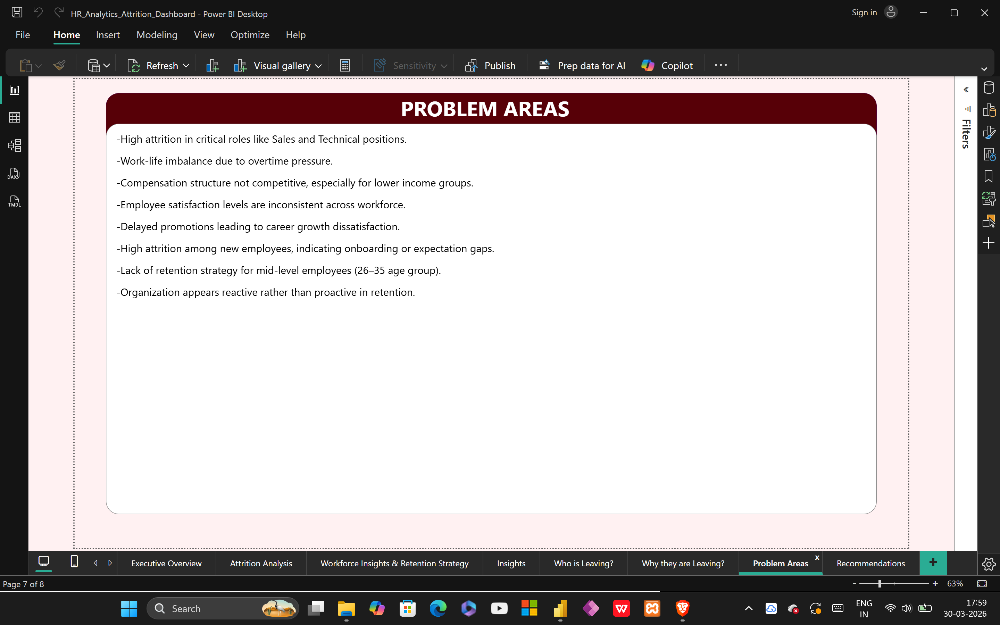
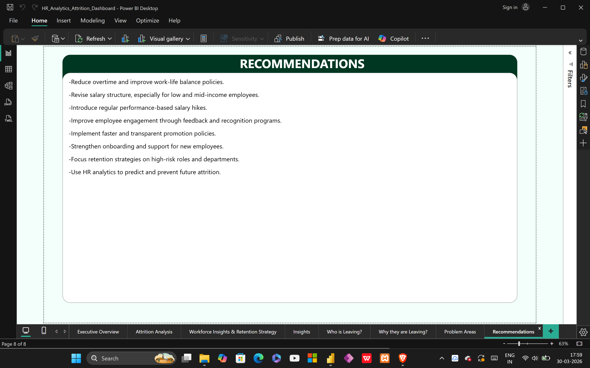

# HR Analytics Attrition Analysis Project

1. Project Overview  
This project focuses on analyzing employee attrition to understand the key factors influencing workforce turnover.  
The dashboard provides insights into employee behavior, department-wise attrition, compensation impact, and retention challenges to support better HR decision-making.

2. Objectives  
- Identify high attrition roles and departments  
- Analyze employee demographics contributing to attrition  
- Understand impact of salary, promotion, and job satisfaction  
- Evaluate workforce trends based on experience and tenure  
- Provide data-driven recommendations for employee retention  

3. Dashboard Features  
- KPI cards showing workforce size, attrition rate, and salary metrics  
- Role-wise and department-wise attrition analysis  
- Age group, gender, and demographic breakdown  
- Work-life balance and job satisfaction analysis  
- Salary hike and income group insights  
- Tenure, experience, and promotion gap analysis  
- Interactive filters (Department, Job Role, Gender, Marital Status)  

4. Key Insights  
- Overall attrition rate is 16%, indicating moderate workforce turnover  
- Laboratory Technician, Sales Executive, and Research roles show highest attrition  
- Research & Development department has the highest employee exits  
- Employees aged 26–35 are most likely to leave  
- Lower salary and smaller salary hikes are strongly linked to attrition  
- Employees with lower job satisfaction and poor work-life balance are more likely to leave  

5. Problem Areas  
- High attrition in critical roles like Sales and Technical positions  
- Work-life imbalance due to overtime pressure  
- Compensation structure not competitive for lower income groups  
- Inconsistent employee satisfaction levels  
- Delayed promotions affecting career growth  
- High attrition among new and mid-level employees  
- Lack of proactive retention strategies  

6. Root Cause Analysis  
- Overtime and workload pressure increase attrition  
- Poor work-life balance leads to dissatisfaction  
- Low job satisfaction drives employee exits  
- Low salary hikes increase turnover probability  
- Promotion delays reduce employee motivation  
- Multiple factors combined (salary, workload, satisfaction) influence attrition  

7. Recommendations  
- Improve work-life balance policies and reduce overtime  
- Revise salary structure for low and mid-income employees  
- Introduce regular and performance-based salary hikes  
- Enhance employee engagement and recognition programs  
- Implement faster and transparent promotion policies  
- Strengthen onboarding and support for new employees  
- Focus retention strategies on high-risk roles and departments  
- Use HR analytics for predictive attrition management  

8. Files in Repository  
- HR_Analytics_Attrition_Dashboard.pbix → Power BI dashboard file  
- HR.csv → Dataset used for analysis  
- Dashboard-overview.png → Main dashboard view  
- Attrition-Analysis-Dashboard.png → Attrition analysis page  
- Retention-Insights-Dashboard.png → Retention insights page  
- Business-Insights-Page.png → Business insights page  
- Profile-Analysis-Page.png → Employee profile analysis  
- Root-Cause-Page.png → Root cause analysis  
- Problem-Areas-Page.png → Problem identification  
- Recommendations-Page.png → Suggested actions  
- INSIGHTS.md → Detailed insights document  

9. Dashboard Preview  

Executive Overview  

Attrition Analysis  

Retention Insights  

Business Insights  

Profile Analysis  

Root Cause Analysis  

Problem Areas  

Recommendations  

10. Tools and Technologies  
- Power BI  
- DAX  
- Data Transformation  
- Data Visualization  

11. Conclusion  
This project demonstrates how HR analytics can be used to identify attrition patterns and improve employee retention strategies.  
The insights derived can help organizations reduce turnover, improve employee satisfaction, and optimize workforce planning.
