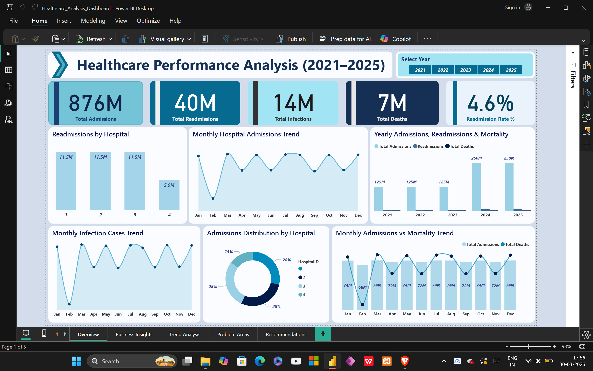
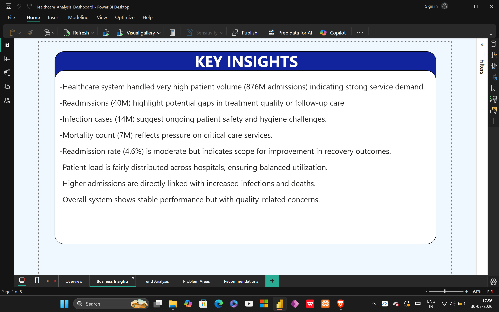
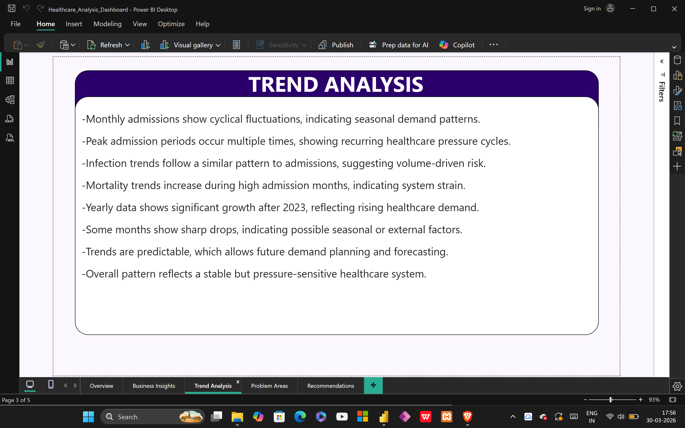
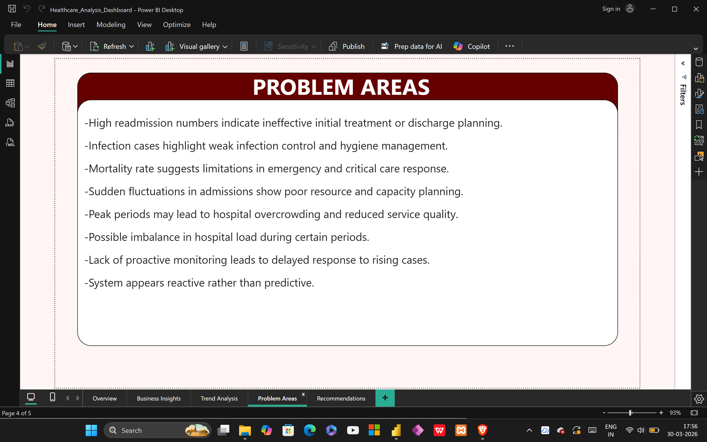
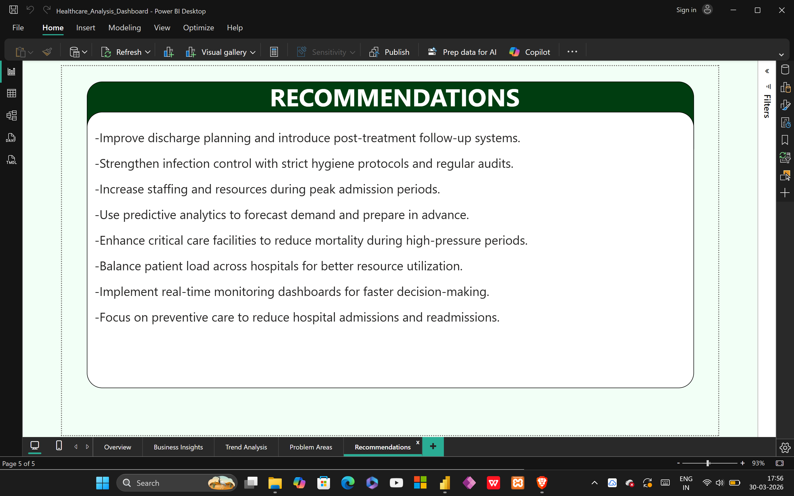

# Healthcare Performance Analysis Project

1. Project Overview  
This project focuses on analyzing healthcare system performance from 2021 to 2025 using SQL and Power BI.  
It provides insights into patient admissions, readmissions, infections, and mortality trends to evaluate system efficiency and healthcare quality.

2. Objectives  
- Analyze patient admission trends across hospitals  
- Identify patterns in readmissions, infections, and mortality  
- Understand the relationship between patient load and healthcare outcomes  
- Detect operational inefficiencies and risk areas  
- Provide data-driven recommendations for healthcare improvement  

3. Data Source and Preparation  
The dataset was generated and managed using SQL Server.  
- Created healthcare database and tables using SQL  
- Generated large-scale synthetic data using SQL queries  
- Stored and structured data for analysis  
- Imported data into Power BI for visualization  

4. Dashboard Features  
- KPI cards showing admissions, readmissions, infections, and mortality  
- Year-wise and month-wise trend analysis  
- Hospital-wise performance comparison  
- Readmission rate analysis  
- Admissions vs mortality comparison  
- Interactive filters for year selection  

5. Key Insights  
- Healthcare system handles very high patient volume (876M admissions)  
- Readmissions indicate gaps in treatment effectiveness and follow-up care  
- Infection cases highlight hygiene and patient safety challenges  
- Mortality reflects pressure on critical care systems  
- Admissions, infections, and deaths are closely related  
- Healthcare demand increases significantly after 2023  

6. Problem Areas  
- High readmission rates indicate ineffective discharge planning  
- Infection cases suggest weak hygiene and control measures  
- Mortality highlights limitations in emergency and critical care  
- Admission fluctuations show poor resource planning  
- Peak periods may lead to overcrowding and reduced service quality  
- System operates reactively rather than predictively  

7. Recommendations  
- Improve discharge planning and follow-up care systems  
- Strengthen infection control protocols and hygiene standards  
- Increase staffing and resources during peak periods  
- Use predictive analytics for demand forecasting  
- Enhance critical care facilities to reduce mortality  
- Balance patient load across hospitals  
- Implement real-time monitoring dashboards  
- Focus on preventive care to reduce admissions and readmissions  

8. Files in Repository  
- Healthcare_Analysis_Dashboard.pbix → Power BI dashboard file  
- Dashboard-Overview.png → Main dashboard view  
- Key-Insights-Page.png → Insights page  
- Trend-Analysis-Page.png → Trend analysis page  
- Problem-Areas-Page.png → Problem identification  
- Recommendations-Page.png → Suggested actions  
- use_of_healthcare_DB.png → SQL data generation  
- use_of_healthcare_DB2.png → SQL query execution  
- INSIGHTS.md → Detailed insights document  

9. Dashboard Preview  

Overview  

Key Insights  

Trend Analysis  

Problem Areas  

Recommendations  

10. Tools and Technologies  
- Power BI  
- DAX  
- SQL Server  
- Data Transformation  
- Data Visualization  

11. Conclusion  
This project demonstrates how healthcare analytics can be used to monitor system performance and identify critical issues.  
The insights can help improve patient care, optimize resource utilization, and support data-driven healthcare decisions.
