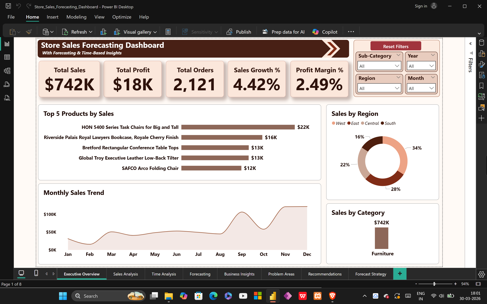
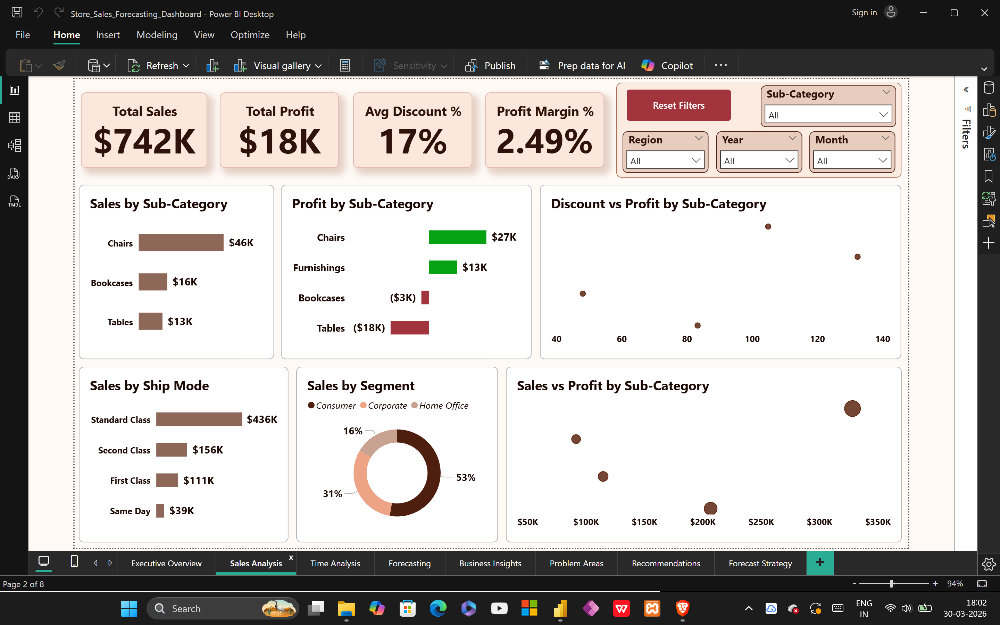
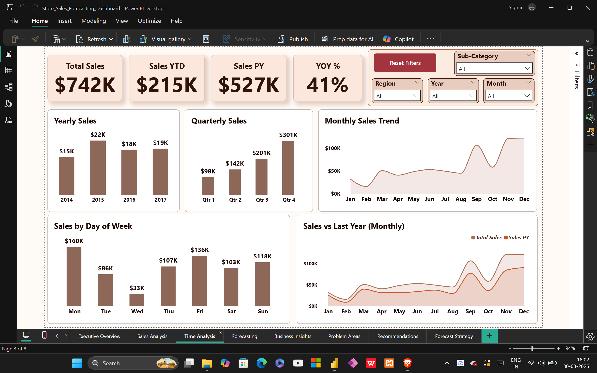
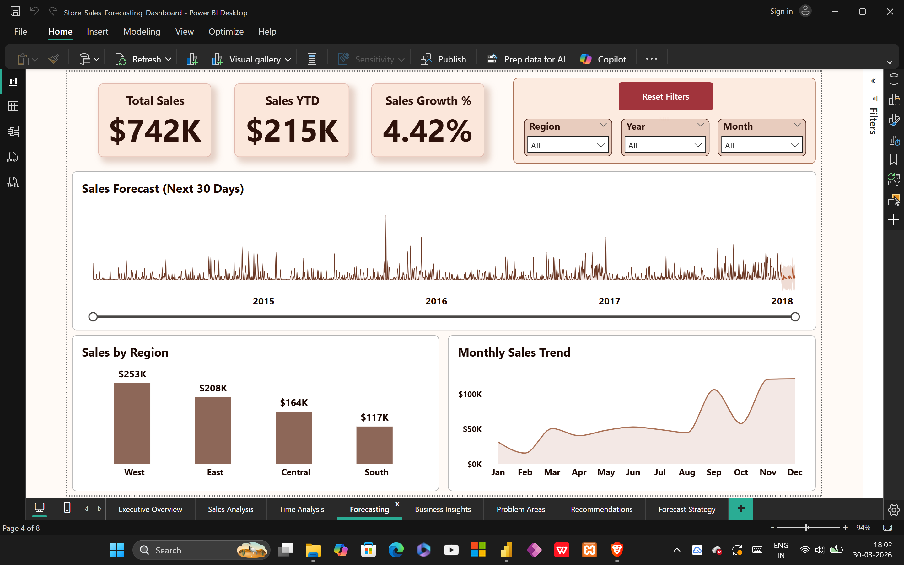
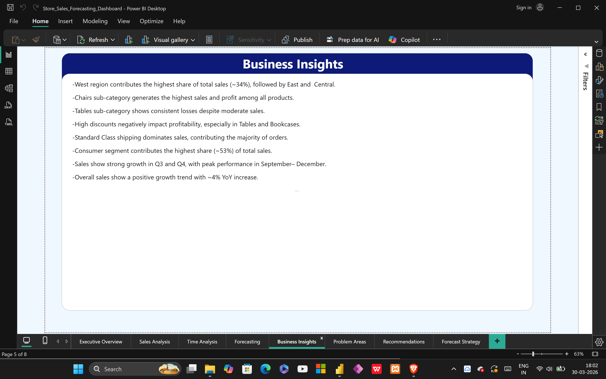
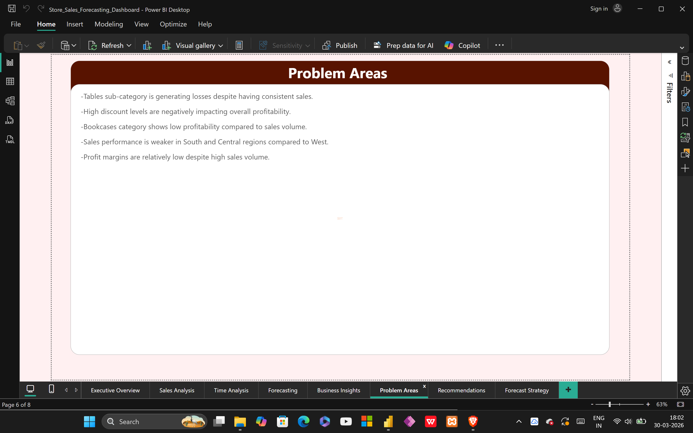
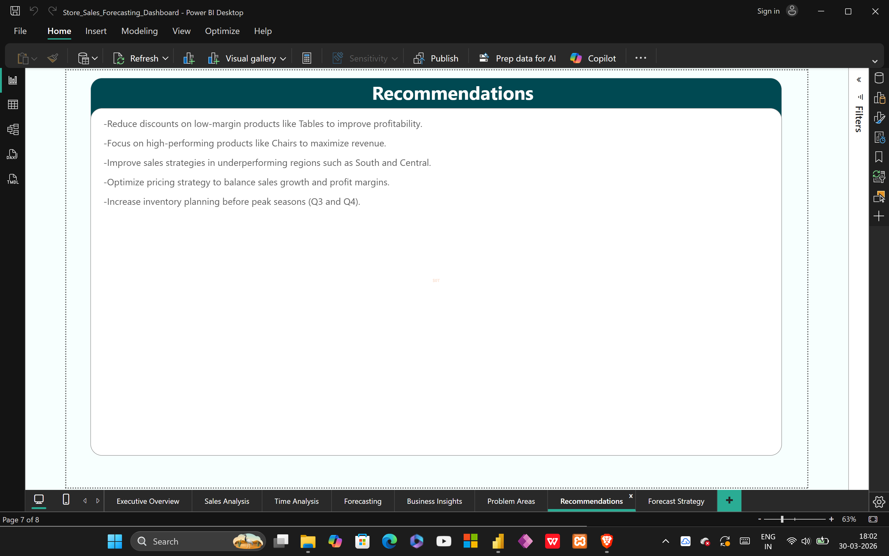
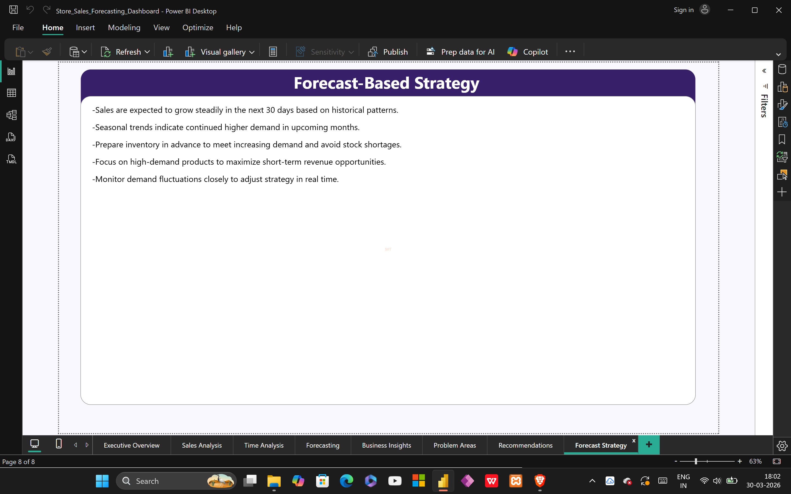

# Store Sales Forecasting Analysis Project

1. Project Overview  
This project focuses on analyzing store sales performance and forecasting future trends using Power BI.  
It provides insights into sales, profit, customer behavior, and demand patterns to support data-driven business decisions.

2. Objectives  
- Analyze overall sales and profitability  
- Identify top-performing products and regions  
- Understand customer segments and sales patterns  
- Detect loss-making areas and inefficiencies  
- Forecast future sales trends for better planning  
- Provide strategic recommendations for business growth  

3. Data Source and Preparation  
- Dataset used: Superstore sales dataset (CSV format)  
- Data cleaning and transformation performed in Power BI  
- Created Date Table for time-based analysis  
- Established relationships between tables (Data Modeling)  

4. Dashboard Features  
- KPI cards: Total Sales, Profit, Orders, Growth %, Profit Margin  
- Sales analysis by category, sub-category, region, and segment  
- Monthly, quarterly, and yearly trend analysis  
- Time-based insights (day, month, year)  
- Forecasting for future sales (next 30 days)  
- Interactive filters (Region, Year, Month, Sub-category)  

5. Key Business Insights  
- West region contributes the highest share of total sales (~34%)  
- Chairs generate the highest profit among all sub-categories  
- Tables show consistent losses despite steady sales  
- High discounts negatively impact profitability  
- Consumer segment contributes the largest share (~53%)  
- Sales peak during Q3 and Q4 (Sep–Dec)  
- Overall sales show positive growth trend (~4% YoY)  

6. Problem Areas  
- Losses in Tables sub-category indicate pricing or cost issues  
- High discount strategy reduces overall profit margins  
- South and Central regions underperform compared to West  
- Some products generate sales but not profit  
- Profit margins remain low despite high revenue  

7. Recommendations  
- Reduce discounts on low-margin products  
- Focus on high-performing products like Chairs  
- Improve sales strategies in underperforming regions  
- Optimize pricing to balance sales and profitability  
- Plan inventory before peak seasons (Q3 & Q4)  

8. Forecast-Based Strategy  
- Sales are expected to grow in the next 30 days  
- Seasonal demand will remain strong in upcoming months  
- Maintain inventory for high-demand products  
- Focus marketing on top-performing categories  
- Use real-time monitoring to adjust strategies quickly  

9. Files in Repository  
- Store_Sales_Forecasting_Dashboard.pbix → Power BI dashboard  
- Store.csv → Dataset  
- Dashboard-overview.png → Overview page  
- Sales-Analysis-Dashboard.png → Sales analysis  
- Time-Analysis-Dashboard.png → Time insights  
- Forecasting-Analysis-Dashboard.png → Forecast page  
- Business-Insights-Page.png → Insights  
- Problem-Areas-Page.png → Issues  
- Recommendations-Page.png → Solutions  
- Forecast-Based-Strategy-Page.png → Strategy  

10. Dashboard Preview  

Executive Overview  

Sales Analysis  

Time Analysis  

Forecasting  

Business Insights  

Problem Areas  

Recommendations  

Forecast Strategy  

11. Tools and Technologies  
- Power BI  
- DAX  
- Data Modeling  
- Data Transformation  
- Forecasting (Power BI Analytics)  

12. Conclusion  
This project demonstrates how sales data can be transformed into actionable insights and forecasting strategies.  
It helps businesses improve profitability, optimize operations, and make informed decisions based on data trends.
